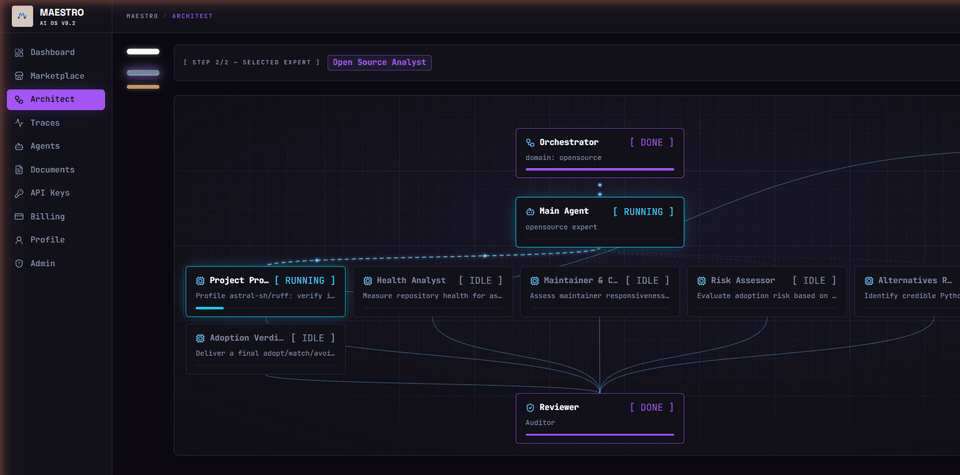
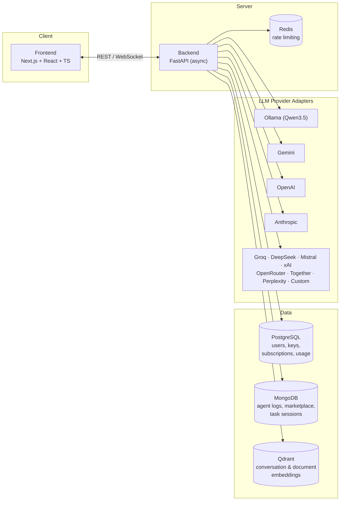

<div align="center">

# Maestro

**Self-hostable AI agent orchestration platform. Bring your own LLM keys (BYOK).**

One prompt in — a multi-layer agent hierarchy out: an Orchestrator routes the task, a
domain Main Agent plans it, Subagents execute it with real tools (web search, data fetch,
sandboxed code execution), and an optional Reviewer audits the results. Everything streams
live over WebSocket, backed by per-user RAG memory and a community Marketplace.

[](https://github.com/Yigtwxx/Maestro/actions/workflows/ci.yml)
[](https://github.com/Yigtwxx/Maestro/releases)
[-blue)](./LICENSE)
[](https://www.python.org)
[](https://nextjs.org)
[](https://github.com/Yigtwxx/Maestro/discussions)

**Fair-code, not OSI open source:** read it, run it, modify it, and self-host it for free —
the one thing you may not do is offer Maestro to third parties as a hosted service
([Sustainable Use License](./LICENSE)).

[Why Maestro](#why-maestro) · [Quick Start](#quick-start) · [Architecture](#architecture) · [Features](#features) · [Development](#development-setup) · [Docs](#documentation) · [Security](#security) · [Roadmap](#roadmap)



*A real run on a local Ollama model: one prompt in, an Orchestrator routes it, a Main Agent
plans it, six subagents execute it, and a Reviewer audits every output — streamed live.*

</div>

---

## Overview

Maestro is a general-purpose platform for orchestrating teams of AI agents. A user submits
a single prompt; the **Orchestrator** classifies it and routes it to a domain **Main
Agent**, which decomposes the work into atomic subtasks and dispatches **Subagents** —
each with a bounded tool set — and, optionally, runs every output past a **Reviewer**
before returning a synthesized answer. The full run streams to the client over WebSocket,
and the Main Agent can pause mid-task to ask the user a clarifying question
(human-in-the-loop).

The platform is **bring-your-own-key**: users connect credentials for any of **25 chat
providers** — OpenAI, Anthropic, Google Gemini, Groq, DeepSeek, Mistral, xAI, OpenRouter,
Together, Perplexity, Cerebras, Fireworks, Moonshot, Qwen and Z.ai among them, with a
`custom` entry for any other OpenAI-compatible endpoint — encrypted at rest with
AES-256-GCM. A further **42 service integrations** (GitHub, X, Slack, Discord, Telegram,
Google Places and more) live in the same vault and drive the connected-API tools.

It also runs with **no paid key at all**: with no provider selected, tasks run on
**Qwen3.5 via a local Ollama endpoint**, which needs no key, and Gemini offers a genuine
free tier (no credit card,
[aistudio.google.com/apikey](https://aistudio.google.com/apikey)). RAG embeddings are
generated locally with `nomic-embed-text`, so the entire pipeline can run offline and
free.

## Why Maestro

Most agent tooling ships as a **library**: you import it, write the graph or crew in
Python, and build everything around it — accounts, key storage, quotas, a UI. Maestro
ships as the **application**. You deploy it, users sign in, and the routing layer picks
the team for each prompt.

| | Maestro | CrewAI / AutoGen | LangGraph | n8n |
|---|---|---|---|---|
| Form factor | Deployable web app (API + UI) | Python library | Python graph runtime | Workflow automation app |
| Who defines the team | Orchestrator routes to one of 15 built-in domain squads | You write the crew in code | You build the graph in code | You wire the nodes by hand |
| Multi-user out of the box | Auth, 2FA, sessions, per-user isolation, quota ledger | — | — | Yes |
| Provider keys | BYOK vault, AES-256-GCM, 67 providers | Env vars in your process | Env vars in your process | Credential store |
| Live run visibility | Architect view over WebSocket, built in | Callbacks and terminal logs | LangSmith (separate hosted service) | Execution view |
| Agent sharing | Marketplace with security scanning and ratings | Copy the code | Copy the code | Workflow templates |
| License | Fair-code (SUL) | OSI open source | OSI open source | Fair-code |

**Where the others are the better choice:** if you want to embed agent logic inside your
own Python service, or you need full control of the control flow graph, use LangGraph or
CrewAI — Maestro is not a library and does not try to be. If your problem is
connector-shaped ("when a row lands in Sheets, call an API, post to Slack"), n8n is a
better fit than an LLM routing layer.

**What Maestro adds on top of a raw agent loop** is mostly the unglamorous part: durable
execution with Postgres checkpoints so a crashed worker resumes instead of hanging, token
budgets per wave and per call, a weighted review rubric with hard-fail criteria, and
failure honesty — a blank subagent answer is a failure, not a silent success, and a run
that could not reach a data source says so in the output instead of inventing numbers.

## Quick Start

Two commands, no build, no configuration — the published images run the whole stack behind
a local reverse proxy.

```bash
git clone https://github.com/Yigtwxx/Maestro.git && cd Maestro
docker compose -f docker-compose.quickstart.yml up -d
```

Then open **http://localhost:8080** and register. The first run pulls images and the
embedding model, so give it a few minutes; afterwards it starts in seconds. If something
already owns port 8080, set `MAESTRO_PORT=8090` in front of the command — it moves the
proxy and the generated links together.

Registration alone cannot start tasks (the platform gates task start on an active plan, and
the bundled payment gateway is a mock). Make your account unmetered instead:

```bash
docker compose -f docker-compose.quickstart.yml exec backend \
  python -m app.scripts.grant_admin --email you@example.com
```

Add a provider key under **Settings > API Keys** — [Gemini's free
tier](https://aistudio.google.com/apikey) needs no credit card — and submit a prompt. RAG
embeddings already run locally, so no key is needed for memory or document upload. To run
chat locally as well:

```bash
docker compose -f docker-compose.quickstart.yml exec ollama ollama pull qwen3.5:9b
docker compose -f docker-compose.quickstart.yml restart backend
```

> The quickstart file uses fixed, publicly known credentials and binds only to
> `127.0.0.1`. It is a trial environment, not a deployment — see
> [Deployment](#deployment) for the real thing.

Prefer to run from source? See [Development setup](#development-setup).

## Architecture

### Agent Hierarchy

The Orchestrator only routes — it never produces work product. The Main Agent plans and
coordinates. Each Subagent performs exactly one atomic task. The Reviewer (toggle:
`reviewer_enabled`) validates outputs and bounces errors back, bounded by
`MAX_REVIEW_ITERATIONS`.


### Task Lifecycle


<details>
<summary><b>System overview</b> — services and data stores</summary>



</details>

Agents communicate via structured JSON messages; the Subagent output and Reviewer feedback
contracts are in [`docs/API.md`](./docs/API.md#agent-contracts).

## Features

| Module | Description | Status |
|---|---|---|
| Auth | Register / login / logout, JWT access tokens + rotating refresh tokens | Live |
| Email verification | Verify / resend / forgot / reset flows via pluggable email providers (console, Resend); soft-gates task start and key creation | Live |
| Two-factor auth | TOTP with QR provisioning and single-use recovery codes | Live |
| Session management | List active sessions, revoke one or all others | Live |
| BYOK key management | AES-256-GCM encrypted storage for 67 providers — 25 chat brains (incl. custom endpoints) and 42 service integrations | Live |
| Task flow | Orchestrator → Main Agent → Subagents → optional Reviewer, live over WebSocket | Live |
| Durable task engine | Postgres-checkpointed steps with lease + heartbeat — a crashed worker's tasks resume instead of hanging; runs multi-worker over a Redis event bus | Live |
| Task history | List, inspect, cancel, and delete past tasks | Live |
| Architect view | Live node map / log stream of inter-agent communication | Live |
| RAG / memory | Per-user conversation history + document embeddings (Qdrant), retrieved at task start | Live |
| Document upload | `.txt` / `.md` upload → chunking → embedding (`nomic-embed-text`) | Live |
| Web search tool | Subagents query DuckDuckGo (`ddgs`), bounded per subtask | Live |
| Data fetch tool | TLS-impersonating HTTP fetch with optional CSS-selector extraction, bounded per subtask | Live |
| Connected-API tools | `repo_intel` (GitHub), `social_search` (X), `community_read` (Discord / Slack / Telegram), `places_intel` (Google Places) | Live |
| Code execution tool | Subagents run Python in a resource-limited Docker sandbox; degrades gracefully when Docker is absent | Live |
| Dashboard & metrics | Token usage, success/failure rate, cost summary from real data | Live |
| Agent profile | Custom agent CRUD, system prompt editing, tool assignment, security scanning | Live |
| Dynamic agents | Custom agents run inside the task flow (`custom:{id}` routing, sandboxed persona) | Live |
| Marketplace | Publish agent teams (mandatory security scan), one-click install, install counter | Live |
| Marketplace reviews | Ratings (one review per user), aggregated scores, install trends, abuse reports | Live |
| Human-in-the-loop | Main Agent can ask the user one clarifying question when uncertain | Live |
| Loop protection | `MAX_ITERATIONS`, `MAX_REVIEW_ITERATIONS`, `TASK_TIMEOUT_SECONDS`, per-subtask tool-call caps | Live |
| Model routing | Per-role model selection: per-task overrides > user preferences > plan-tier defaults | Live |
| SSRF guard | Custom provider endpoints and every fetched URL validated: http(s) only, credential-free, publicly routable | Live |
| Rate limiting | Every endpoint throttled; Redis-backed sliding window with in-memory fallback | Live |
| Subscriptions & quota | Starter / Pro / Scale plans, per-period token quota, usage ledger; **mock payment gateway** | Live |
| Legal & GDPR | Terms / privacy / security / acceptable-use / cookies pages; account deletion + data export | Live |
| Admin & moderation | Role-gated admin surface: user suspension, marketplace / review moderation, report queue, audit log | Live |
| Observability | Optional Sentry error tracking (backend + frontend), structured JSON logging, request IDs | Live |
| Tracing & costs | Optional per-task span tracing with waterfall + cost breakdowns by day / model / domain | Live |
| Deployment | Single Docker Compose stack, Caddy single-origin TLS, GHCR images, SSH rollout, off-site backups | Live |
| Real payment processor | Swap the mock gateway for iyzico / PayTR / Adyen / Stripe via one adapter | Planned |
| i18n / GraphQL | UI localization; GraphQL API if REST performance requires it | Planned |

## Tech Stack

| Layer | Technology | Purpose |
|---|---|---|
| Frontend | Next.js 16 (App Router) + React 19 + TypeScript + Tailwind + Zustand | UI, SSR, routing, state |
| Backend | FastAPI (async) + Pydantic v2 | Agent communication, REST / WebSocket API |
| Relational DB | PostgreSQL + SQLAlchemy (async) + Alembic | Users, subscriptions, billing, usage |
| NoSQL DB | MongoDB + Motor | Agent logs, marketplace content, task sessions |
| Vector DB | Qdrant | RAG memory, document embeddings |
| Cache / limiter | Redis | Sliding-window rate limiting, cross-worker event bus |
| Real-time | WebSocket (FastAPI) | Live agent status, human-in-the-loop Q&A |
| Authentication | Backend JWT (in-house auth) + optional TOTP | User session management |
| Encryption | AES-256-GCM | BYOK API key security |
| LLM providers | 25 chat adapters — Ollama, OpenAI, Anthropic, Gemini, Groq, DeepSeek, Mistral, xAI, OpenRouter, Together, Perplexity, and any custom OpenAI-compatible endpoint | Provider-agnostic adapter layer with fallback |
| Embeddings | `nomic-embed-text` via Ollama | Free / local embeddings for RAG |
| Web fetch | Scrapling (curl_cffi TLS impersonation, lxml/CSS) | `data_fetch` page text and selector extraction |
| Containerization | Docker Compose + Caddy | Local infra and single-origin production stack |

The frontend uses the `class-variance-authority` + `clsx` + `tailwind-merge` primitive
pattern for components; there is no runtime `shadcn/ui` dependency.

## Development setup

For running from source rather than the published images.

**Prerequisites:** Docker (Postgres, Mongo, Qdrant, Redis), Python 3.11+, Node.js 20+, and
[Ollama](https://ollama.com) for the free local model and embeddings.

The dev scripts bring the whole stack up in one terminal — infrastructure, then the backend
(virtualenv, dependencies, `alembic upgrade head`, marketplace seed, uvicorn), then the
frontend. Ctrl+C stops everything.

```bash
./scripts/dev.ps1     # Windows
./scripts/dev.sh      # macOS / Linux
```

Backend serves on `http://localhost:8000` (Swagger at `/docs`), frontend on
`http://localhost:3000`.

<details>
<summary><b>Manual setup</b> — step by step</summary>

```bash
# 1. Environment
cp .env.example .env                 # fill in JWT_SECRET and API_KEY_MASTER_KEY
openssl rand -hex 32                 # JWT_SECRET
openssl rand -base64 32              # API_KEY_MASTER_KEY

# 2. Infrastructure
docker compose up -d                 # postgres, mongo, qdrant, redis

# 3. Local models (free tier)
ollama serve                         # separate terminal
ollama pull qwen3.5:9b
ollama pull nomic-embed-text

# 4. Backend
cd backend
python -m venv .venv
# Windows: .venv\Scripts\activate | macOS/Linux: source .venv/bin/activate
pip install -r requirements.txt
alembic upgrade head
uvicorn app.main:app --reload        # http://localhost:8000

# 5. Frontend
cd frontend
npm install
npm run dev                          # http://localhost:3000
```

</details>

### Verification

CI runs on every push and PR to `main`: backend (ruff lint + format check + pytest +
dependency-lock freshness check) and frontend (ESLint + type-check + production build);
non-draft PRs additionally build-verify both Docker images. See
[`.github/workflows/ci.yml`](./.github/workflows/ci.yml).

```bash
cd backend && pytest && ruff check . && ruff format --check .
cd frontend && npm run lint && npm run type-check && npm run build
```

When adding a new LLM provider, existing code is never modified — a new adapter class is
added in `backend/app/services/llm_service.py` (OpenAI-compatible providers subclass a
shared base and are a few lines each). The same pattern applies to payment providers
(`backend/app/services/payment/`).

### Project layout

```
maestro/
├── frontend/src/     app/ (auth · app · marketing), components/, lib/, stores/, types/
├── backend/app/      main.py, core/, api/v1/, agents/, models/, schemas/, services/, utils/
├── backend/alembic/  PostgreSQL migrations
├── scripts/          dev.ps1 · dev.sh · backup.sh
├── docs/             DEPLOYMENT.md · CONFIGURATION.md · API.md
└── CLAUDE.md         Architecture & standards (single source of truth)
```

## Documentation

| Document | Contents |
|---|---|
| [`CLAUDE.md`](./CLAUDE.md) | Architecture, conventions, and the invariants that must not be broken — the single source of truth |
| [`docs/CONFIGURATION.md`](./docs/CONFIGURATION.md) | Every environment variable, grouped by concern, with defaults |
| [`docs/API.md`](./docs/API.md) | Full endpoint list, agent JSON contracts, database schemas |
| [`docs/DEPLOYMENT.md`](./docs/DEPLOYMENT.md) | Production rollout, rollback, backups, purge cron |
| [`CONTRIBUTING.md`](./CONTRIBUTING.md) | Local setup and the pull request workflow |
| [`SECURITY.md`](./SECURITY.md) | Vulnerability disclosure process |

Two secrets are required before any run — `JWT_SECRET` and `API_KEY_MASTER_KEY`. Generate
them with `openssl rand -hex 32` and `openssl rand -base64 32`. In production the backend
refuses to boot with placeholder or weak values.

## Self-hosting vs Maestro Cloud

Maestro follows the fair-code model (like n8n): the source is public and self-hosting is
free, while a hosted subscription funds development.

| | Self-hosted | Maestro Cloud (hosted) |
|---|---|---|
| Cost | Free | Subscription (Starter / Pro / Scale) |
| Setup | `docker compose up` — you run Postgres, Mongo, Qdrant, Redis, Ollama | None — sign up and start |
| LLM access | Your own keys (BYOK) or fully local via Ollama + Qwen — zero external calls | Your own keys (BYOK) |
| Data | Never leaves your machine | Encrypted at rest, GDPR tooling built in |
| Updates & maintenance | You pull and migrate | Managed |
| Restrictions | Internal, personal, and non-commercial use — you may not resell Maestro as a hosted service to third parties | — |

Hosted plans are Starter $5 / Pro $15 / Scale $50 per month for 500K / 3M / 10M monthly
tokens. There is no free plan and no trial: quota is enforced through the append-only
Postgres `usage_records` ledger, and every terminal task path — success, error, timeout,
cancellation — writes the tokens it spent. Payments currently run through a **mock
gateway** that validates card numbers (Luhn + BIN) but moves no real money.

## Security

- **BYOK keys** are encrypted with AES-256-GCM and never stored, logged, or returned to
  the frontend in plaintext. The master key exists only in `API_KEY_MASTER_KEY`.
- **Loop protection:** `MAX_ITERATIONS` per Subagent, `MAX_REVIEW_ITERATIONS` for the
  Reviewer loop, `TASK_TIMEOUT_SECONDS` per task, and per-subtask caps on every tool.
- **SSRF guard:** user- and model-supplied URLs must be http(s), credential-free, and
  resolve only to publicly routable addresses — redirects to internal addresses are
  refused before the request is made, blocking probes of cloud metadata services.
- **Prompt injection:** fetched content is delimited, marked untrusted, and scanned before
  a model sees it; Marketplace uploads and custom system prompts pass automatic scanning
  and execute inside an `<agent_persona>` sandbox.
- **Sandboxed code execution:** subagent-generated Python runs in a throwaway Docker
  container with memory, CPU, and wall-clock limits — never in the API process, and off by
  default.
- **Account security:** optional TOTP two-factor auth (encrypted secret, Argon2-hashed
  single-use recovery codes) and rotating refresh tokens with reuse detection — replaying a
  rotated token revokes the entire session family.
- **Isolation:** RAG memory and all user data are partitioned per user. Every WebSocket
  connection is authenticated before `accept()` and rate-limited like HTTP routes.
- **Right to erasure / portability:** `DELETE /users/me` locks the account and schedules a
  30-day-grace purge (Mongo → Qdrant → Postgres, ordered so the flag row is removed last);
  `GET /users/me/export` returns a full JSON export.

See [`CLAUDE.md`](./CLAUDE.md) §8 for the full policy. To report a vulnerability, follow
[`SECURITY.md`](./SECURITY.md) — please do not open a public issue.

## Deployment

Maestro ships as a single Docker Compose stack: Postgres, MongoDB, Qdrant, Redis, an Ollama
embedding service, the API, the web app, and Caddy for automatic TLS. Caddy is the only
service that opens a port and serves the app and API from one origin, so there is no CORS
and no domain baked into any image. A 4 GB VM is sufficient.

```bash
# on the host, alongside docker-compose.prod.yml and Caddyfile
cp .env.prod.example .env.prod        # fill in DOMAIN and the generated secrets
docker compose -f docker-compose.prod.yml --env-file .env.prod up -d
```

Pushing a `v*` tag builds multi-arch images to GHCR and rolls them out over SSH. Migrations
run as a one-shot service the API waits on, so a failed migration never starts a new
backend. Full guide — rollback, backups, the account-purge cron, and why the API cannot run
on Vercel — is in [`docs/DEPLOYMENT.md`](./docs/DEPLOYMENT.md).

## Roadmap

Development follows a vertical-slice-first approach — a solid foundation, then one
end-to-end flow at a time.

**Shipped.** Auth and BYOK key management; the end-to-end task flow with live WebSocket
streaming; RAG memory and document upload; multi-provider LLM adapters; dashboard metrics;
custom agents and the Marketplace; subscriptions, quota and the usage ledger; GDPR account
deletion and data export; containerization behind a single-origin Caddy stack; Redis-backed
rate limiting; the SEO surface; Backend v2 (durable execution, distributed runtime, LLM
layer v2, dynamic agent registry, span tracing, the quality layer); email verification;
TOTP two-factor auth and session management; marketplace reviews; the admin and moderation
surface; off-site backups; fully pinned dependency lockfiles.

**Next.** A real payment processor, the pre-purge reminder email, i18n (starting with the
Turkish KVKK notice), and GraphQL if REST performance ever requires it.

See [`CLAUDE.md`](./CLAUDE.md) for the full breakdown.

## Contributing

Contributions are welcome. Start with [`CONTRIBUTING.md`](./CONTRIBUTING.md) for local
setup and the pull request workflow; participation is governed by the
[Code of Conduct](./CODE_OF_CONDUCT.md). Questions and ideas belong in
[Discussions](https://github.com/Yigtwxx/Maestro/discussions).

The standards live in [`CLAUDE.md`](./CLAUDE.md): English code and comments; Python 3.11+
with required type annotations and `ruff`; TypeScript `strict: true` with functional
components and Prettier; business logic in `services/` with thin route handlers; new LLM
and payment providers added as adapters rather than edits; and an explicit rate limit on
every new endpoint. Run the relevant layer's lint, test, and type-check commands before
opening a PR.

## License

Maestro is distributed under the [Sustainable Use License](./LICENSE) (fair-code, the same
model as n8n). In short:

- **Free to self-host** — use, modify, and run Maestro for your own internal business,
  personal, or non-commercial purposes, on any hardware, at no cost.
- **Free to redistribute** non-commercially and free of charge.
- **Not allowed:** offering Maestro (or a modified version) to third parties as a hosted or
  managed service — i.e. running a competing "Maestro Cloud".

This is a source-available license, not an OSI-approved open-source license. It exists so
the code can stay public while the hosted service funds development. When in doubt about a
use case, open a discussion and ask.

Versions published before 2026-07-11 were distributed under Apache-2.0 and remain available
under that license. The Maestro name and logo are trademarks and are not covered by the
license.

---

<div align="center">

Architecture and standards: [`CLAUDE.md`](./CLAUDE.md)

</div>
